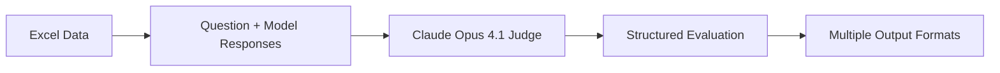

# CRA Multi-Model Evaluation System

## Overview

This evaluation system assesses the quality and accuracy of multiple AI models' responses to Canada Revenue Agency (CRA) related questions. It uses Claude Opus 4.1 via OpenRouter as an expert judge to evaluate responses from various models, focusing specifically on Canadian federal tax information accuracy.

## How It Works

### 1. Data Input
The script reads from an Excel file (`genai-answers.xlsx`) containing:
- **Question column**: User questions about CRA services, tax matters, or account access
- **Model response columns**: Answers from different AI models (auto-detected as columns with >120 characters average length)

### 2. Evaluation Process



Each evaluation batch:
1. Extracts a question and all model responses
2. Adds CRA-specific context to ensure proper interpretation
3. Sends to Claude Opus 4.1 with strict evaluation criteria
4. Receives structured JSON evaluation
5. Processes results into multiple output formats

### 3. Evaluation Criteria

The judge evaluates **ONLY factual correctness** regarding CRA information, not style or formatting.

#### Key Metrics:

- **Verdict**: Categorical assessment of the response
  - `correct` = Fully accurate and complete
  - `partially_correct` = Some correct information but has issues
  - `incorrect` = Materially wrong or misleading
  - `uncertain` = Judge lacks confidence in CRA-specific facts to assess

  *Note: Most evaluations show "uncertain" as Claude Opus is conservative when not completely sure about specific CRA facts.*

- **Correctness Score (0-1)**: Numerical assessment providing nuance even when verdict is uncertain
  - 1.0 = Fully correct & materially complete
  - 0.5 = Partially correct
  - 0.0 = Materially incorrect/misleading

  *Example: Verdict="uncertain", Score=0.8 means the judge isn't confident enough to call it "correct" but rates it 80% accurate based on known information.*

- **Critical Errors**: Statements that would materially mislead a taxpayer
  - Wrong eligibility requirements
  - Incorrect rates, amounts, dates, or forms
  - Wrong procedures or portals

- **Key Points Missing**: Important facts that SHOULD be present for a safe, correct answer

- **Unsupported Assertions**: Specific claims that cannot be justified from well-known CRA facts

- **Consistency Score (0-1)**: Measures how consistent model responses are for this question
  - 1.0 = Perfect consistency (all models scored similarly)
  - 0.5 = Moderate consistency
  - 0.0 = Very inconsistent responses
  - Calculated using standard deviation of model scores

- **Agreement Level**: Categorical assessment of model agreement
  - High: Score variance ≤ 0.1 between models
  - Medium: Score variance 0.1-0.3
  - Low: Score variance > 0.3

- **Contradictions**: Number of direct factual disagreements between models
  - Examples: Different tax rates, conflicting procedures, incompatible account identifiers

- **Unique Facts**: Number of fact groups mentioned by only one model
  - Identifies comprehensive vs. minimal responses
  - Highlights unique insights or details

## Output Files

### 1. `per_question_eval.jsonl`
Raw JSON Lines format with complete evaluation data for each question.

### 2. `summary_scores.csv`
High-level scoring summary:
```csv
QID | Question | Model | Verdict | Correctness | CriticalErrorCount | MissingCount
```

**Score Calculation**:
- `Correctness`: Direct score from evaluator (0-1)
- `CriticalErrorCount`: Count of critical errors identified
- `MissingCount`: Count of key missing points

### 3. `per_question_details.csv` & `per_question_details.xlsx`
Detailed evaluation breakdown including all metrics:
```csv
QID | Question | Model | Verdict | Correctness | CriticalErrors | UnsupportedAssertions | KeyPointsCovered | KeyPointsMissing | Notes | ConsistencyScore | AgreementLevel | Contradictions | UniqueFacts
```

**Fields**:
- `CriticalErrors`: Semicolon-separated list of specific errors
- `UnsupportedAssertions`: Claims that can't be verified
- `KeyPointsCovered`: Important points correctly addressed
- `KeyPointsMissing`: Important omissions
- `Notes`: Additional evaluator observations
- `ConsistencyScore`: See Key Metrics above
- `AgreementLevel`: See Key Metrics above
- `Contradictions`: See Key Metrics above
- `UniqueFacts`: See Key Metrics above

### 4. `cross_model_flags.csv` & `cross_model_flags.xlsx`
Cross-model comparison data:
```csv
QID | Type | Model | MissingFromModels | Details
```

**Column Descriptions**:
- `QID`: Question identifier
- `Type`: Either "Unique Facts" or "Contradiction"
- `Model`:
  - For Unique Facts: The model that provided the unique information
  - For Contradictions: All models involved in the disagreement
- `MissingFromModels`:
  - For Unique Facts: Models that didn't mention these facts
  - For Contradictions: Always "N/A"
- `Details`:
  - For Unique Facts: The actual facts (semicolon-separated)
  - For Contradictions: The topic of disagreement only (no model positions)

**Cross-Model Analysis Types**:

1. **Unique Facts**: Information one model provides that others omit
   - Identifies comprehensive vs. minimal responses
   - Highlights unique insights or details
   - Example: "CRA phone number 1-800-959-8281; Security code required"

2. **Contradictions**: Direct disagreements between models
   - Tax rates, eligibility criteria
   - Procedures or portal names
   - Account types or identifiers
   - Example: "Business Number format" or "What constitutes the CRA account number"

## Example Output Insights

### Common Findings from Evaluations

1. **Phone Numbers**: Models often differ on whether to include CRA contact numbers
2. **Security Details**: Some models mention banking credentials aren't shared with CRA, others omit
3. **Business Number Format**: Major contradiction area - 9 digits vs. 15 characters debate
4. **Account Identifiers**: Disagreement about whether CRA has separate account numbers from SIN
5. **Sign-In Partner Changes**: Conflicting information about switching from Sign-In Partner to CRA user ID

### Interpretation Guide

### Correctness Scores
- **High Correctness Score (0.8-1.0)**: Generally reliable information
- **Medium Score (0.5-0.7)**: Some issues but core information likely correct
- **Low Score (0.0-0.4)**: Significant errors or missing critical information
- **Uncertain Verdict**: Judge being conservative; check correctness score for relative quality

### Using Consistency Metrics for Quality Assurance
1. **High Agreement + High Scores**: Most reliable answers
2. **High Agreement + Low Scores**: All models struggling (knowledge gap)
3. **Low Agreement + Mixed Scores**: Some models have better information
4. **Low Agreement + Low Scores**: Problematic question or topic area

## Configuration

### Environment Variables
```bash
OPENROUTER_API_KEY=sk-or-v1-xxx  # Required for OpenRouter access
```

### Command Line Options
```bash
python evaluate_cra.py \
  --xlsx "genai-answers.xlsx" \      # Input Excel file
  --sheet "Sheet1" \                  # Specific sheet (optional)
  --models "GPT-4,Claude,Gemini" \    # Model columns (auto-detected if omitted)
  --model "anthropic/claude-opus-4.1" # Judge model
  --outdir "eval_out" \               # Output directory
  --max-rows 10                       # Limit rows for testing
```

## Scaling Considerations

### 1. Performance Optimization
- **Batch Processing**: Process multiple questions in parallel
- **Caching**: Cache evaluations by question+answer hash to avoid re-evaluation
- **Async API Calls**: Implement concurrent API requests with rate limiting

### 2. Cost Management
- **Sampling Strategy**: Evaluate representative samples rather than full datasets
- **Tiered Evaluation**: Use cheaper models for initial screening, Opus for final evaluation
- **Response Deduplication**: Skip evaluation of identical responses

### 3. Quality Improvements

#### Grounding with URLs
Enhance evaluation accuracy by:
```python
# Add official CRA URL validation
CRA_DOMAINS = [
    "canada.ca/en/revenue-agency",
    "canada.ca/fr/agence-revenu",
    "apps.cra-arc.gc.ca"
]

# Verify cited sources in responses
def validate_urls(response_text):
    urls = extract_urls(response_text)
    return [url for url in urls if any(domain in url for domain in CRA_DOMAINS)]
```

#### Fact Database Integration
```python
# Build knowledge base from official sources
CRA_FACTS = {
    "tax_rates": load_from_cra_api(),
    "deadlines": parse_cra_calendar(),
    "forms": scrape_form_directory(),
    "programs": extract_program_details()
}

# Cross-reference model claims
def verify_claim(claim, fact_db):
    return fact_db.lookup(claim.entity, claim.attribute)
```

### 4. Advanced Analytics

#### Temporal Analysis
Track model performance over time:
- Accuracy trends by model version
- Seasonal accuracy variations (tax season vs. off-season)
- Response consistency across updates

#### Error Pattern Detection
```python
# Identify systematic issues
def analyze_error_patterns(evaluations):
    patterns = {
        "rate_errors": [],
        "deadline_errors": [],
        "eligibility_errors": [],
        "portal_confusion": []
    }
    # Categorize and track error types
    return patterns
```

## Best Practices

### 1. Data Preparation
- Ensure questions are clear and unambiguous
- Include edge cases and complex scenarios
- Balance question types (accounts, taxes, benefits, deadlines)

### 2. Evaluation Consistency
- Use consistent judge model and parameters
- Document any prompt changes
- Version control evaluation criteria

### 3. Result Interpretation
- "Uncertain" verdicts indicate judge knowledge limitations
- Low scores may indicate outdated training data
- Cross-model contradictions highlight areas needing verification

## Future Enhancements

### 1. Multi-Language Support
Extend to French CRA content:
```python
JUDGE_PREAMBLE_FR = """Vous êtes un évaluateur expert de l'Agence du revenu du Canada (ARC)..."""
```

### 2. Automated Fact Checking
```python
# Real-time verification against CRA API
async def verify_fact(claim):
    cra_api_response = await cra_client.verify(claim)
    return cra_api_response.is_valid
```

### 3. Confidence Calibration
```python
# Add confidence scores to evaluations
"confidence_level": 0.95,  # Judge's confidence in evaluation
"evidence_quality": "strong",  # Based on verifiable sources
```

### 4. Interactive Dashboard
- Real-time evaluation monitoring
- Model comparison visualizations
- Error trend analysis
- Export capabilities for stakeholder reports


### Debug Mode
Enable detailed logging:
```python
# Add to script
import logging
logging.basicConfig(level=logging.DEBUG)
```

